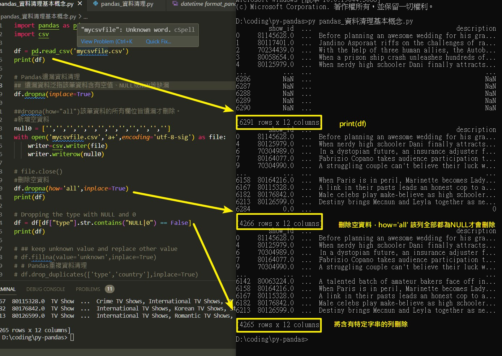
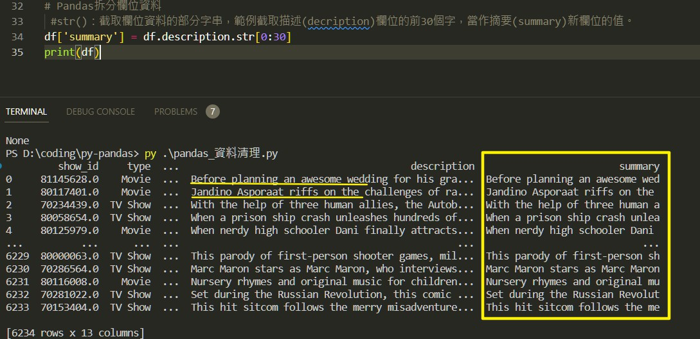
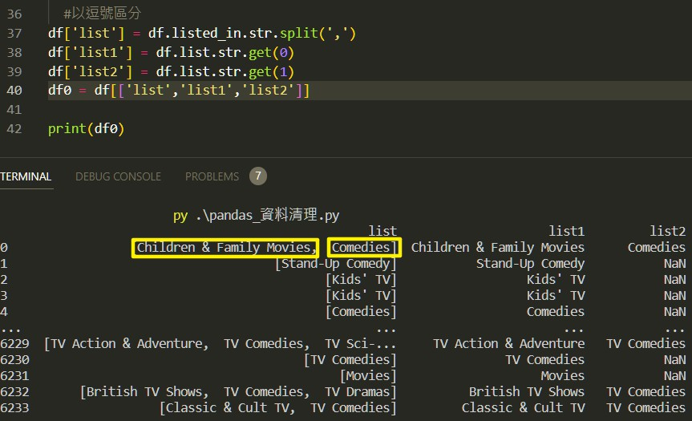
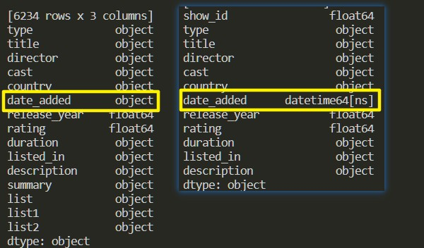
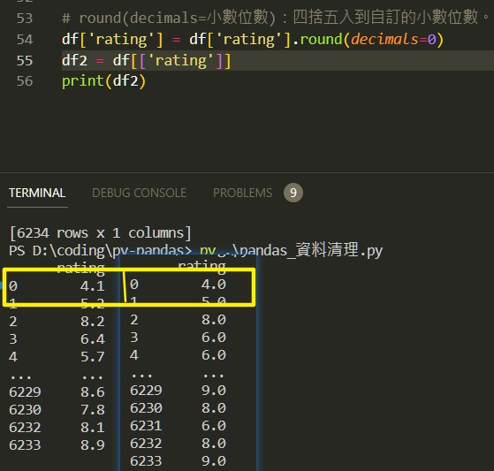
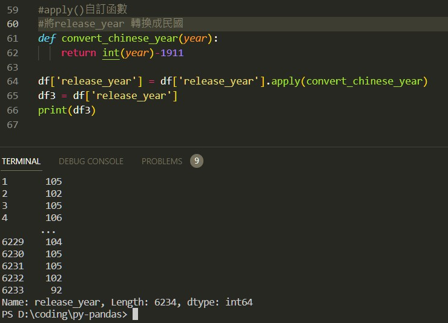

# pandas_missing-data_and-headling
Attributes and underlying data
Pandas套件提供了資料清理的方法(Method)，這次取「Netflix data with IMDB scores added」資料集(mycsvfile.csv)為例，練習以下部分:

- Pandas遺漏資料清理
- Pandas重複資料清理
- Pandas拆分欄位資料
- Pandas格式化資料
- Pandas 四捨五入
- Pandas應用function

### pandas 遺漏資料
- dropna
  #### 刪除遺漏資料泛指該筆資料含有空值、NULL或NaN等缺漏
- dropna(how='all')
  #### 該筆資料的所有欄位皆遺漏才刪除。
- df[df['type'].str.contain(NULL|0)==False]
  #### Dropping the type with NULL and 0
  

- df.fillna(value='unknown',inplace=True)
  #### keep unknown value and replace other value

### Pandas重複資料清理
- df.drop_duplicates(['type','country'],inplace=True)

### pandas 拆分欄位資料
- 取段落中前三十個字元
  ##### df[summary] = df.description.str[0:30]
  
- 逗號區分，並以str取得資料
  ##### 逗號區分
  
  ##### 取得資料
  

### Pandas格式化資料

### pandas 四捨五入

### Pandas應用function

